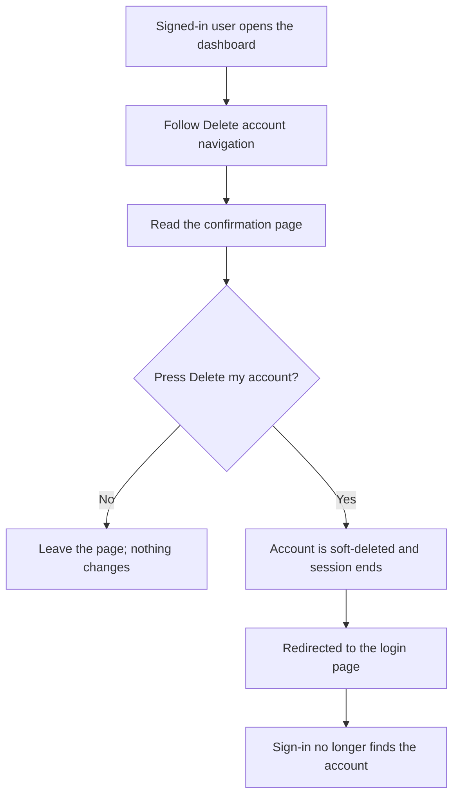
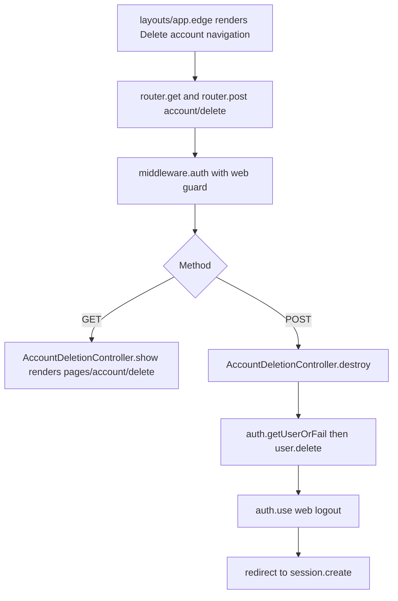

# US-DEMO-03 — Delete your own account through the hypermedia starter

As a signed-in user of the hypermedia starter app, I want to confirm and delete my account so that I am signed out and cannot sign in again unless an administrator restores it.

**Status:** Demo; source-reviewed in the [v0.13.0 hypermedia app](https://github.com/Kevinjohn/oss-adonisjs-starter-examples/tree/v0.13.0/apps/hypermedia); the local native-auth contract fixture is retained but was not run for this documentation change.
**Access:** Authenticated user (`middleware.auth()`); the account deleted is always the caller's own.
**Entry:** From the signed-in dashboard, follow **Delete account** in the shared navigation to the `GET /account/delete` confirmation page, then use **Delete my account** (`POST /account/delete`).
**Documentation:** [Instance lifecycle methods](../../docs/reference/README.md#instance-lifecycle-methods).
**Source:** [Routes](https://github.com/Kevinjohn/oss-adonisjs-starter-examples/blob/v0.13.0/apps/hypermedia/start/routes.ts) (lines 118-126), [AccountDeletionController](https://github.com/Kevinjohn/oss-adonisjs-starter-examples/blob/v0.13.0/apps/hypermedia/app/controllers/account_deletion_controller.ts) (lines 5, 13-17), [confirmation view](https://github.com/Kevinjohn/oss-adonisjs-starter-examples/blob/v0.13.0/apps/hypermedia/resources/views/pages/account/delete.edge), [shared navigation](https://github.com/Kevinjohn/oss-adonisjs-starter-examples/blob/v0.13.0/apps/hypermedia/resources/views/components/layouts/app.edge).
**Coverage:** [Local hypermedia native-auth contract tests](../../examples/starter/hypermedia/tests/functional/soft_delete.spec.ts), [local browser navigation test](../../examples/starter/hypermedia/tests/browser/soft_delete.spec.ts).

## Acceptance criteria

- The signed-in dashboard navigation exposes **Delete account** to every member. The deletion form has one control, the "Delete my account" submit button, and no user-entered fields (the shared form component adds a hidden CSRF token); the shared layout adds its usual navigation, theme toggle and log-out controls. It warns that the account is hidden at once, the user is signed out and an administrator can restore it.
- `destroy` calls `user.delete()`, logs out the `web` guard and redirects to the `session.create` route.
- The row stays with `deletedAt` set; ordinary `User` queries no longer find it, so it cannot sign in. [US-DEMO-04](us-demo-04-hypermedia-admin-restore.md) restores it.
- A guest is redirected by `middleware.auth()` before either route runs. There is no separate cancel control other than leaving the page.

## User flow

```mermaid
flowchart TD
    A["Signed-in user opens the dashboard"] --> N["Follow Delete account navigation"]
    N --> B["Read the confirmation page"]
    B --> C{"Press Delete my account?"}
    C -->|No| D["Leave the page; nothing changes"]
    C -->|Yes| E["Account is soft-deleted and session ends"]
    E --> F["Redirected to the login page"]
    F --> G["Sign-in no longer finds the account"]
```

## Code flow

Scope: starter routes and controller through the package's instance `delete()`; session and form handling are AdonisJS behavior.

```mermaid
flowchart TD
    N["layouts/app.edge renders Delete account navigation"] --> A
    A["router.get and router.post account/delete"] --> B["middleware.auth with web guard"]
    B --> C{"Method"}
    C -->|GET| D["AccountDeletionController.show renders pages/account/delete"]
    C -->|POST| E["AccountDeletionController.destroy"]
    E --> F["auth.getUserOrFail then user.delete"]
    F --> G["auth.use web logout"]
    G --> H["redirect to session.create"]
```

**Code references:** [routes](https://github.com/Kevinjohn/oss-adonisjs-starter-examples/blob/v0.13.0/apps/hypermedia/start/routes.ts), [controller](https://github.com/Kevinjohn/oss-adonisjs-starter-examples/blob/v0.13.0/apps/hypermedia/app/controllers/account_deletion_controller.ts), [view](https://github.com/Kevinjohn/oss-adonisjs-starter-examples/blob/v0.13.0/apps/hypermedia/resources/views/pages/account/delete.edge), [shared navigation](https://github.com/Kevinjohn/oss-adonisjs-starter-examples/blob/v0.13.0/apps/hypermedia/resources/views/components/layouts/app.edge), [SoftDeletes mixin](../../src/mixin.ts), [local functional tests](../../examples/starter/hypermedia/tests/functional/soft_delete.spec.ts).
